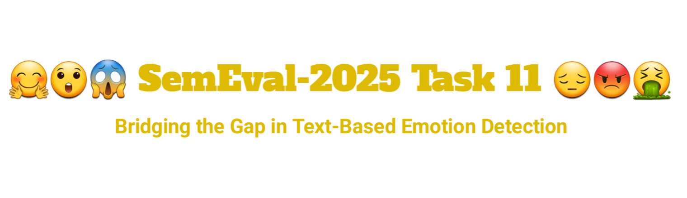

<!--  

  
    <h1 align="center"> </h1>

 -->
# SemEval-2025 Task 11: Bridging the Gap in Text-Based Emotion Detection 😔😱😡

- [Emotion Recognition in Text](#Emotion-Recognition-in-Text)
- [Languages](#languages)
- [Tracks](#tracks)
  - [Track A: Multi-label Emotion Detection](#track-a-multi-label-emotion-detection)
  - [Track B: Emotion Intensity (ordinal)](#track-b-emotion-intensity-ordinal)
  - [Track C: Cross-lingual Emotion Detection](#track-c-cross-lingual-emotion-detection)
- [Dataset Structure](#dataset-structure)
- [Evaluation](#evaluation)
- [Important Dates and Phases of the Task](#important-dates-and-phases-of-the-task)
- [How to Participate](#how-to-participate)
- [Competition Rules and Terms](#competition-rules-and-terms)
- [Dataset Paper](#dataset-paper)
- [Communication](#communication)
- [Frequently Asked Questions (FAQs)](#frequently-asked-questions-faqs)
- [Resources](#resources)
- [Organizers](#Organizers)

# Emotion Recognition in Text

Emotions are simultaneously familiar and mysterious. On the one hand, we all express and manage our emotions every day. Yet, on the other hand, emotions are complex, nuanced, and sometimes hard to articulate. We also use language in subtle and complex ways to express emotion. Further, people are highly variable in how they perceive and express emotions (even within the same culture or social group). Thus, we can never truly identify how one is feeling based on something that they have said with absolute certainty. 

Emotion recognition is not one task but an umbrella term for several tasks such as detecting the emotions of the speaker, identifying what emotion a piece of text is conveying and detecting emotions evoked in a reader. 

This task is on **perceived emotion** and focuses on:

- **Determining what emotion most people will think the speaker may be feeling given a sentence or short text snippet uttered by the speaker.**

The task is **not** about:

- The emotion evoked in the reader.
- The emotion of someone else mentioned in the text.
- Or **even** the true emotion of the speaker (which cannot be definitively known from just a short text snippet).

We acknowledge the importance of this distinction as perceived emotions can differ from actual emotions due to various factors such as cultural context, individual differences in emotional expression, and the limitations of text-based communication.

## Languages

The shared task includes the following languages:

- [Afrikaans](https://en.wikipedia.org/wiki/Afrikaans), [Algerian Arabic](https://en.wikipedia.org/wiki/Algerian_Arabic), [Amharic](https://en.wikipedia.org/wiki/Amharic), [Hausa](https://en.wikipedia.org/wiki/Hausa_language), [Igbo](https://en.wikipedia.org/wiki/Igbo_language), [Kinyarwanda](https://en.wikipedia.org/wiki/Kinyarwanda), [Moroccan Arabic](https://en.wikipedia.org/wiki/Moroccan_Arabic), [Mozambican Portuguese](https://en.wikipedia.org/wiki/Mozambican_Portuguese), [Nigerian-Pidgin](https://en.wikipedia.org/wiki/Nigerian_Pidgin), [Oromo](https://en.wikipedia.org/wiki/Oromo_language), [Setswana](https://en.wikipedia.org/wiki/Tswana_language), [Somali](https://en.wikipedia.org/wiki/Somali_language), [Swahili](https://en.wikipedia.org/wiki/Swahili_language), [Tigrinya](https://en.wikipedia.org/wiki/Tigrinya_language),[Xitsonga](https://en.wikipedia.org/wiki/Tsonga_language), [isiXhosa](https://en.wikipedia.org/wiki/Xhosa_language), [Yoruba](https://en.wikipedia.org/wiki/Yoruba_language), [isiZulu](https://en.wikipedia.org/wiki/Zulu_language) [Arabic](https://en.wikipedia.org/wiki/Arabic), [Chinese](https://en.wikipedia.org/wiki/Chinese_language), [Hindi](https://en.wikipedia.org/wiki/Hindi), [Indonesian](https://en.wikipedia.org/wiki/Indonesian_language), [Javanese](https://en.wikipedia.org/wiki/Javanese_language), [Marathi](https://en.wikipedia.org/wiki/Marathi_language) [English](https://en.wikipedia.org/wiki/English_language), [German](https://en.wikipedia.org/wiki/German_language), [Romanian](https://en.wikipedia.org/wiki/Romanian_language), [Russian](https://en.wikipedia.org/wiki/Russian_language), [Spanish](https://en.wikipedia.org/wiki/Spanish_language), [Tatar](https://en.wikipedia.org/wiki/Tatar_language), [Ukrainian](https://en.wikipedia.org/wiki/Ukrainian_language), [Swedish](https://en.wikipedia.org/wiki/Swedish_language) [Brazilian Portuguese](https://en.wikipedia.org/wiki/Brazilian_Portuguese)

## Tracks

Participants can participate in one or more of the following tracks:

- **Track A: Multi-label Emotion Detection**: Given a set of labeled training data in a target language, predict one or more emotions that the speaker is likely feeling in the text from the following emotion classes and neutral: Joy, Sadness, Fear, Anger, Surprise, Disgust, or Neutral.

- **Track B: Emotion Intensity (ordinal)**: Given a set of labeled training data in a target language annotated with emotion, classify the text into one of four ordinal classes of intensity that best represents the emotional state of the writer:
(1) No emotion, (2),  A low amount of emotion (3) A moderate amount of emotion (4) A high amount of emotion

- **Track C: Cross-lingual Emotion Detection**: Given training and validation data in English, predict the emotion of a new text instance in a different target language from the set of six emotion classes: Joy, Sadness, Fear, Anger, Surprise, Disgust, or classified as Neutral.

## Dataset Structure

The dataset structure will vary depending on the track:

- **Track 1**: [Example Text, Joy, Sadness, Fear, Anger, Surprise, Disgust, Neutral]
- **Track 2**: [Example Text, 0,1,2,4]
- **Track 3**: [Example Text, Joy, Sadness, Fear, Anger, Surprise, Disgust, Neutral]

For each track, we provide the sample dataset, training dataset, and evaluation dataset in the following folders: [Track A](#), [Track B](#), [Track](#)

## Evaluation

The performance of each submission will be evaluated using F1-score based on the predicted labels and the gold ones. Participants will be provided with an evaluation script and a starter kit that includes a simple baseline.

## Important Dates and Phases of the Task

| Description                   | Deadline                                        |
|-------------------------------|------------------------------------------------|
| Sample Data Ready             | 15 July 2024                                  |
| Training Data Ready           | 02 September 2024                         |
| Evaluation Start              | 10 January 2025                                 |
| Evaluation End                | 31 January 2025                                 |
| System Description Paper Due  | 28 February 2025                               |
| Notification to authors       | 31 March 2025                                   |
| Camera ready due              | 21 April 2025                                   |
| SemEval workshop 2025         | (co-located with a major NLP conference)   |

The task will be divided into three phases: Development, Evaluation, and Post-Evaluation. The following summarize the phases and their timelines.

    
<strong>Development Phase:</strong> Codalab submission link coming soon

    <ul>
      <li>This phase runs from 02 September to 10 January 2024.</li>
      <li>Train (with gold labels) and dev data (without gold labels) will be released for this phase.</li>
      <li>Train and evaluate your model on the dev set via CodaLab.</li>
      <li>Up to 999 submissions are allowed, and the leaderboard is open for you to view your results and those of others.</li>
    </ul>
  

  

    
<strong>Evaluation Phase:</strong> Codalab submission link coming soon

    <ul>
      <li>This phase runs from around 10 January to 31 January 2024 (tentative).</li>
      <li>Test data will be released (without gold labels).</li>
      <li>Participants will have the opportunity to evaluate their models on the test data.</li>
      <li>Each team is allowed only one submission. This single submission will be considered your official entry for the competition.</li>
      <li>The leaderboard is disabled and will only be published after the submission deadline.</li>
    </ul>
  

  

    
<strong>Post-Evaluation Phase:</strong>  Codalab submission link coming soon

    <ul>
      <li>Starts around 31 January 2024 and never ends.</li>
      <li>In this phase, you can still submit and test your system even after the official competition ends. This way, you can keep improving your work.</li>
      <li>We will make the leaderboard public again so you can see how you are doing compared to others.</li>
      <li>You can use CodaLab to talk with other participants, share ideas, and learn how to make your system better.</li>
    </ul>
  

## How to Participate

1. **Register**: Sign up on the Codalab competition platform (link to be provided).
2. **Track**: Decide on the track(s) you want to participate in (Track A, B and/or C)
3. **Download**: Access to the datasets for each track will be provided in this repository.
4. **Develop**: Build your models using the provided data.
5. **Submit**: Submit your predictions on the Codalab competition platform (link to be provided).

## Competition Rules and Terms

  
1. Consent to Public Release of Scores

  <ul>
    <li>By submitting results, you consent to the public release of your scores on:
      <ul>
        <li>the competition website,</li>
        <li>at the designated workshop,</li>
        <li>in associated proceedings.</li>
      </ul>
    </li>
    <li>Task organizers have discretion over the release and choice of metrics.</li>
    <li>Scores may include:
      <ul>
        <li>automatic and manual quantitative judgments,</li>
        <li>qualitative judgments,</li>
        <li>other metrics as deemed appropriate.</li>
      </ul>
    </li>
  </ul>

  
2. Score Release and Validity

  <ul>
    <li>Task organizers reserve the right to withhold scores for:
      <ul>
        <li>incomplete submissions,</li>
        <li>erroneous submissions,</li>
        <li>deceptive submissions,</li>
        <li>rule-violating submissions.</li>
      </ul>
    </li>
    <li>Inclusion of a submission's scores does not constitute endorsement.</li>
  </ul>

  
3. Team Participation Rules

  <ul>
    <li>Participants may be involved in only one team.</li>
    <li>Exceptions may be granted with prior approval from organizers.</li>
  </ul>

  
4. Account Management

  <ul>
    <li>Each team must create and use exactly one account on the designated platform.</li>
  </ul>

  
5. Team Constitution

  <ul>
    <li>Team membership cannot be changed after the evaluation period begins.</li>
  </ul>

  
6. Development Period Rules

  <ul>
    <li>Teams can submit up to 999 submissions.</li>
    <li>Results are visible only to the submitting team.</li>
    <li>Leaderboard is disabled.</li>
    <li>Warnings and errors are visible for each submission.</li>
  </ul>

  
7. Evaluation Period Rules

  <ul>
    <li>Teams are limited to 3 submissions.</li>
    <li>Only the final submission is considered official.</li>
    <li>Warnings and errors are visible for each submission.</li>
  </ul>

  
8. Post-Competition

  <ul>
    <li>Gold labels will be released after the competition.</li>
    <li>Teams are encouraged to report results on all system variants in their description paper.</li>
    <li>Official submission results must be clearly indicated.</li>
  </ul>

  
9. Public Release of Submissions

  <ul>
    <li>Final team submissions may be made public after the evaluation period.</li>
  </ul>

  
10. Disclaimer on Datasets

  <ul>
    <li>Organizers and affiliated institutions provide no warranties on dataset correctness or completeness.</li>
    <li>They are not liable for dataset access or usage.</li>
  </ul>

  
11. Peer Review Process

  <ul>
    <li>Each participant will review another team's system description paper.</li>
  </ul>

  
12. Dataset Usage Restrictions

  <ul>
    <li>Datasets should only be used for scientific or research purposes.</li>
    <li>Any other use is explicitly prohibited.</li>
    <li>Datasets must not be redistributed or shared with third parties.</li>
    <li>Interested parties should be directed to the official website.</li>
  </ul>

  
13. Final ranking

  <ul>
    <li>To be included in the official task ranking, you **MUST** submit a system description paper.</li>
  </ul>

## Dataset paper

We will soon release a dataset paper that describes the data collection, annotation process, and baseline experiments. This paper will provide additional details and information that will be useful for the task participants.

## Communication

- Join our Discord Channel to ask questions and receive updates. 
- Contact organizers at: to emotion-semeval-2025-organisers[at]googlegroups[dot]com

## Frequently Asked Questions (FAQs)

## Ethical considerations.

##  Resources

1. [SemEval 2025 Shared Tasks](https://semeval.github.io/SemEval2025/tasks)
2. [Frequently Asked Questions about SemEval](https://semeval.github.io/faq.html)
3. [Paper Submission Requirements](https://semeval.github.io/paper-requirements.html)
4. [Guidelines for Writing Papers](https://semeval.github.io/system-paper-template.html)
5. [Paper style files](https://github.com/acl-org/acl-style-files)
6. [Previous shared-tasks on emotion detection](#)
7. [Resources for Beginners](#)
8. Paper submission link (TBD)

## Organizers
